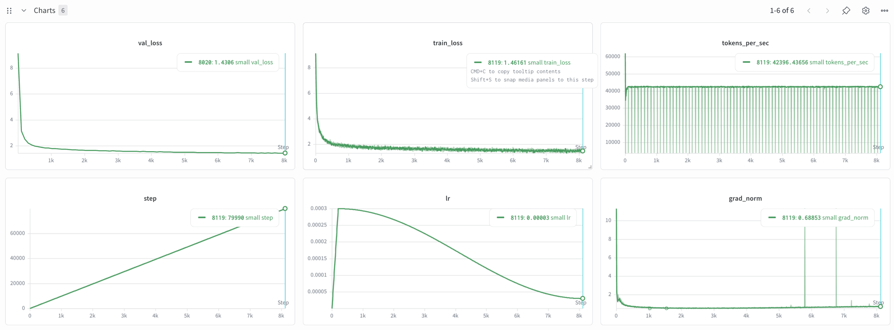
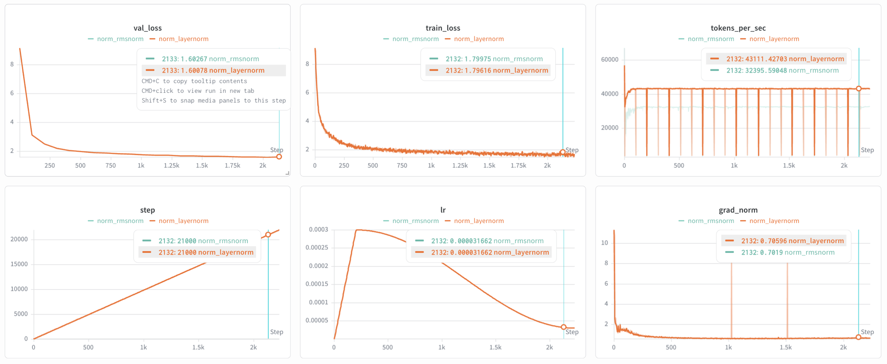
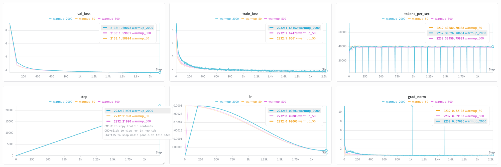
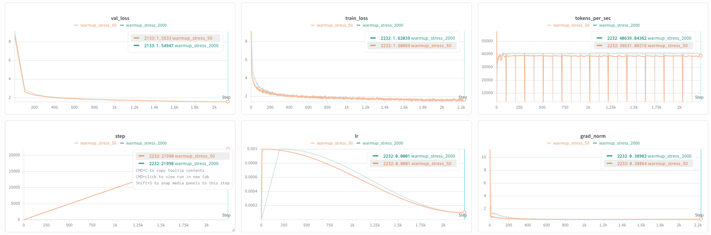
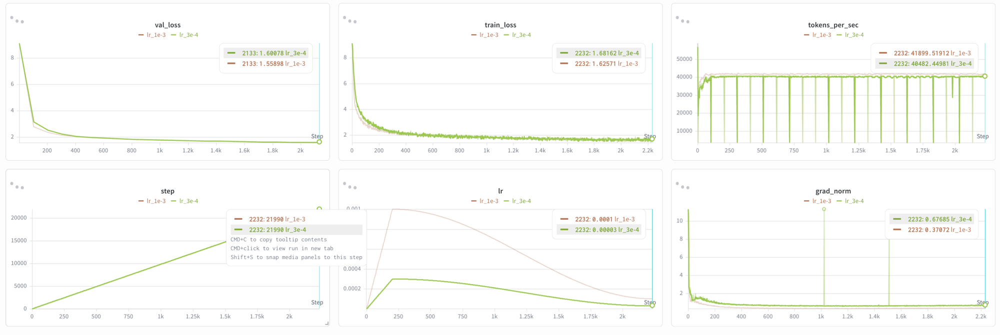
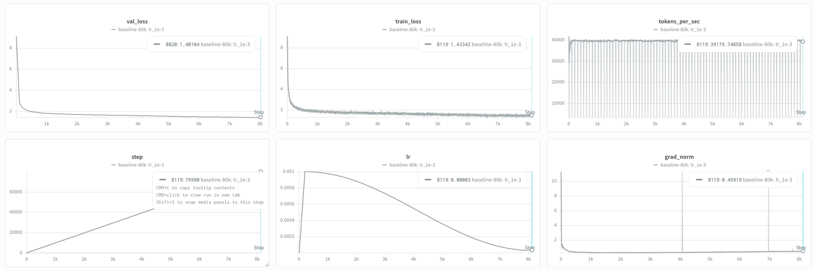
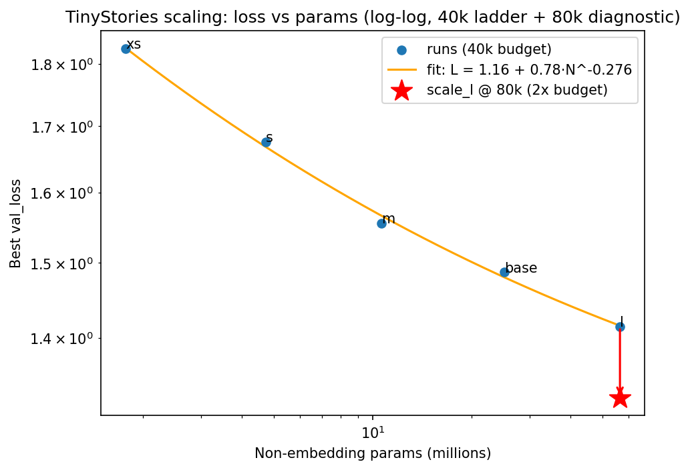

# my-LLM

A small language model built **from scratch** as a learning project: a ~30M
parameter decoder-only transformer trained on the
[TinyStories](https://huggingface.co/datasets/roneneldan/TinyStories) dataset,
running on Kaggle's free T4 GPUs.

The goal is to understand transformers deeply by implementing the core pieces by
hand — model, training loop, data pipeline, and tokenizer — and then running a
set of controlled experiments, ending in a technical write-up.

## Highlights

- **From scratch, no shortcuts.** The transformer is built directly on PyTorch
  tensor ops — embeddings, multi-head causal self-attention, and the training
  loop are hand-written, with no `nn.Transformer` or HuggingFace `model` classes
  doing the heavy lifting.
- **Multi-head attention done the clean way.** Heads are vectorized into a
  single batched matmul (reshape Q/K/V to `(batch, num_heads, seq, head_dim)`)
  rather than looped — the same approach production implementations use.
- **Built bottom-up and tested as it grows.** Each component is its own
  `nn.Module` snapping together against a known `(batch, seq_len, hidden_size)`
  contract, covered by a runnable end-to-end shape test plus a gradient-flow
  test that proves the whole model is trainable (see [Tests](#tests)).
- **Config-driven and reproducible.** Hyperparameters live in versioned YAML
  configs; a fixed seed keeps weights and inputs deterministic during
  development.
- **Designed for a real compute budget.** ~30M params targeting a single free
  Kaggle T4 — small enough to iterate fast, large enough to produce coherent
  text.

## Goals

- Implement a decoder-only transformer end to end, no high-level model libraries.
- Train it to generate coherent TinyStories-style text on a single T4.
- Run **ablations** to build intuition for which design choices matter:
  - RMSNorm vs LayerNorm
  - Warmup length
  - (add others as you go)
- Run a small **scaling experiment** (model size / data / compute vs loss).
- Write it all up as a technical blog post.

## Build progress

Implemented and smoke-tested so far:

- [x] BPE tokenizer training + encode/decode round-trip checks
- [x] Dataset inspection (story counts, char stats, samples)
- [x] YAML config loader (attribute + item access)
- [x] Token + learned-position embeddings
- [x] Multi-head causal self-attention (vectorized across heads)
- [x] Position-wise feed-forward network (GeLU, `d_ff` = 4 × hidden_size)
- [x] Full transformer block (pre-norm attention + FFN, residual connections)
- [x] GPT wrapper (stacked blocks + final norm + LM head → logits)
- [x] Training loop (AdamW, warmup + cosine schedule, AMP, grad clipping, checkpointing, wandb)
- [x] Kaggle T4 runner (notebook + tokenized Kaggle Dataset)
- [x] Sampling / generation (`scripts/generate.py`, stops at end-of-text)
- [x] Baseline trained: 30M model, 80k steps, **val_loss 1.401** at `max_lr: 1e-3` (1.43 at the original 3e-4) (see [Results](#results))
- [x] Config-selectable norm type + hand-written RMSNorm; **RMSNorm-vs-LayerNorm ablation trained** — quality tie, LayerNorm faster (see [Ablations](#ablations))
- [x] Warmup-length ablation (50/500/2000) + high-LR/no-clip stress variant trained — negligible effect at this scale; AdamW makes warmup redundant (see [Ablations](#ablations))
- [x] LR sweep (3e-4 / 1e-3 / 3e-3) — **peak LR is the real lever**: 1e-3 cuts val_loss 0.042 vs baseline, then plateaus (see [Ablations](#ablations))
- [x] Scaling study — 5-point width+depth ladder (1.8M–56.6M non-embed) fit to `L ≈ 1.16 + 0.78·N^−0.276` (R² 0.9975); 80k diagnostic shows the floor is **compute-limited, not a data ceiling** (see [Scaling study](#scaling-study))
- [ ] Evaluation: custom TinyStories rubric (LLM-as-judge) + GPT-2 comparison
- [ ] Technical blog post write-up

## Tests

The model has no external test runner yet — tests live in each module's
`__main__` block and run on execution. For the model:

```bash
python src/model.py
```

This runs three checks against the `configs/tiny.yaml` model:

| Check | What it verifies |
| --- | --- |
| **End-to-end shape** | A `(batch, seq_len)` batch of token IDs produces logits of shape `(batch, seq_len, vocab_size)`. One forward pass exercises embeddings, every block's attention + FFN + norms, the final norm, and the LM head. |
| **Parameter count** | Reports total params (≈ budget). Doubles as a wiring check: a plain `list` instead of `nn.ModuleList`, or a submodule not assigned to `self.`, would silently drop blocks from the count. |
| **Gradient flow** | Builds a tiny throwaway GPT, backprops `logits.sum()`, and asserts every parameter receives a *non-zero* gradient — i.e. the whole model is connected to the autograd graph and trainable. Catches disconnected/untrained submodules that a shape check can't. |

Latest run (`tiny.yaml`: 4 layers, hidden 128, 4 heads, vocab 16k):

```
gpt out shape: (2, 128, 16000)
OK: GPT returns (batch, seq_len, vocab_size)
params: 4.9M
OK: gradients flow to all parameters
```

> The 4.9M here is the fast **debug** config; the ~30M target model uses a
> larger `hidden_size`. At this size the token embedding + LM head (vocab ×
> hidden) account for ~84% of params.

## Project structure

```
my-LLM/
├── configs/              # YAML experiment configs (see configs/tiny.yaml)
├── notebooks/
│   ├── exploration.ipynb  # scratch
│   └── kaggle_train.ipynb # Kaggle T4 run: clone → install → link data → train
├── scripts/
│   ├── dataset_stats.py  # inspect raw TinyStories (counts, char stats, samples)
│   ├── prepare_data.py   # download + tokenize TinyStories
│   ├── generate.py       # sample text from a trained checkpoint
│   └── kaggle_dataset/   # dataset-metadata.json for the tokenized Kaggle Dataset
├── src/
│   ├── model.py          # transformer: embeddings, attention, FFN, blocks, GPT wrapper
│   ├── train.py          # training loop
│   ├── data.py           # data loading / batching
│   ├── tokenizer.py      # tokenizer training
│   └── paths.py          # env-overridable paths (DATA_DIR, TOKENIZER_PATH, CKPT_DIR, CONFIG_PATH)
├── requirements.txt
└── README.md
```

> Data, checkpoints, tokenizers, and logs are git-ignored (regenerable / large).

## Setup

Local (CPU or GPU):

```bash
python -m venv .venv && source .venv/bin/activate
pip install -r requirements.txt
# Install a torch build matching your CUDA — see https://pytorch.org/get-started/
```

On **Kaggle**, `torch` and `numpy` are preinstalled with CUDA for the T4. Don't
reinstall torch there; just add the lighter deps:

```bash
pip install tokenizers datasets pyyaml tqdm matplotlib
```

## Usage

<!-- Fill these in as the scripts take shape. -->

```bash
# 0. (optional) Inspect the raw dataset: story count, char stats, samples
python scripts/dataset_stats.py

# 1. Prepare data (download + train tokenizer + tokenize corpus)
python scripts/prepare_data.py --config configs/tiny.yaml

# 1b. (optional) Sanity-check the trained tokenizer: vocab size + encode/decode round-trip
python -m src.tokenizer

# 2. Train (defaults to configs/tiny.yaml; pick another with CONFIG_PATH=...)
python src/train.py

# 3. Generate
python scripts/generate.py --checkpoint checkpoints/... --prompt "Once upon a time"
```

## Run on Kaggle

Training targets a free Kaggle T4. The tokenized corpus and tokenizer ship as a
private **Kaggle Dataset** (the `.bin` files are too large for git), and
`notebooks/kaggle_train.ipynb` wires it all together: clone the repo, install
deps, point the code at the dataset, train.

**One-time: publish the tokenized data as a private Dataset** (from the repo root,
needs the [Kaggle CLI](https://github.com/Kaggle/kaggle-api) authenticated via
`kaggle auth login`):

```bash
# stage the payload next to its metadata (hardlinks -> no ~900 MB copy)
ln -f data/train.bin data/val.bin tokenizer/tokenizer.json scripts/kaggle_dataset/
kaggle datasets create  -p scripts/kaggle_dataset                  # first upload
kaggle datasets version -p scripts/kaggle_dataset -m "refresh"     # later updates
```

**Then on Kaggle:** open `notebooks/kaggle_train.ipynb`, set Accelerator → GPU T4,
add the dataset as input, optionally add a `WANDB_API_KEY` secret, and Run All.

### Path overrides

`src/paths.py` resolves every path the run touches from environment variables,
falling back to the local layout — so the same code runs unchanged on Kaggle
(read-only data under `/kaggle/input`) with no edits or symlinks:

| Env var | Default | What |
| --- | --- | --- |
| `DATA_DIR` | `data` | dir holding `train.bin` / `val.bin` |
| `TOKENIZER_PATH` | `tokenizer/tokenizer.json` | tokenizer JSON |
| `CKPT_DIR` | `checkpoints` | checkpoint output dir |
| `CONFIG_PATH` | `configs/tiny.yaml` | YAML config to load |

So a one-off ablation needs no code change:

```bash
CONFIG_PATH=configs/no_warmup.yaml python src/train.py
```

## Experiments

| Experiment            | Variable            | Configs                     | Status |
| --------------------- | ------------------- | --------------------------- | ------ |
| Norm ablation         | RMSNorm vs LayerNorm| `ablation_norm_{layernorm,rmsnorm}.yaml` | Done — loss tie; LayerNorm ~33% faster (unfused RMSNorm) |
| Warmup length         | warmup_steps (50/500/2000) | `ablation_warmup_{50,500,2000}.yaml` | Done — null; warmup redundant with AdamW |
| Warmup under stress   | warmup_steps @ 10× LR, no clip | `ablation_warmup_stress_{50,2000}.yaml` | Done — still null; neither diverges |
| LR sweep              | max_lr (3e-4/1e-3/3e-3) | `ablation_lr_{3e-4,1e-3,3e-3}.yaml` | Done — 1e-3 best (−0.042); LR is the real lever |
| Scaling               | model size (5-point ladder) + 80k diagnostic | `scale_{xs,s,m,base,l}.yaml`, `scale_l_80k.yaml` | Done — power-law fit; floor is compute-limited |

## Results

### Baseline — 30M model, 80k steps

The ~30M model (`configs/small.yaml`: hidden 512, 8 layers, 8 heads, vocab 8k,
seq 256 → **33.6M params**) trained on a single Kaggle T4 for the full 80k-step
warmup + cosine schedule (~4.5 h at ~42k tokens/sec):



| Metric | Value |
| --- | --- |
| **val_loss** | **1.401** (train 1.433) at `max_lr: 1e-3`; 1.43 at the original 3e-4 |
| Throughput | ~42k tokens/sec (fp16 AMP, batch 32) |
| Params | 33.6M |
| Schedule | linear warmup (2k) → cosine decay to 10% of peak |

Sample (prompt `"Once upon a time"`, temperature 0.8):

> Once upon a time, there was a little girl named Lily. She loved to play in the
> garden with her toys. One day, she found a shiny rock and she wanted to keep it
> safe. She put it in her pocket and went to play with her toys. … She remembered
> the shiny rock in her pocket and thought it might make a magic wand.

The model produces fluent, coherent TinyStories-style narratives with consistent
characters and a clear story arc. Residual small-model artifacts (occasional
repetition or mild logic drift) are expected at this scale and are exactly what
the planned scaling study is meant to probe.

## Ablations

### 1. RMSNorm vs LayerNorm

**Status:** complete — both 22k-step arms trained on a Kaggle T4.

RMSNorm is hand-written (`src/model.py`, ~6 lines: divide each token vector by
its root-mean-square, then apply one learned scale — no mean-subtraction and no
shift, unlike LayerNorm). The norm type is selectable per run via `norm_type` in
the config, so the two arms share identical code and differ in exactly one field:

- `configs/ablation_norm_layernorm.yaml` — `norm_type: layernorm`
- `configs/ablation_norm_rmsnorm.yaml` — `norm_type: rmsnorm`

Both run at a reduced **22k-step** budget (vs the 80k baseline) to keep ablations
cheap, and share `wandb_group: norm_ablation` so their curves auto-overlay in
Weights & Biases.

**Implementation sanity checks** (done before spending any GPU time — a random
`(2, 4, 16)` input through each norm):

| Property | LayerNorm | RMSNorm |
| --- | --- | --- |
| Per-token mean of output | ≈ 0 (it re-centers) | non-zero (never centers) |
| Per-token RMS of output | ≈ 1 | ≈ 1 |

Both control magnitude identically (RMS ≈ 1); only LayerNorm also forces the mean
to 0. That single difference — LayerNorm's extra centering + shift parameter — is
the whole substance of the ablation.

**Parameter cost.** On the `tiny.yaml` debug build (hidden 128, 4 layers → 9
norms), LayerNorm gives 2.866M params vs RMSNorm's 2.865M. The ~1.15k gap is
exactly RMSNorm dropping LayerNorm's per-feature shift vector (9 norms × 128).
RMSNorm is strictly lighter.

**Pipeline smoke test.** A 200-step CPU run of the LayerNorm arm confirmed the
full path end to end: config → model builds with `norm_type` → training loop
(`train_loss` 9.13 → 3.94) → eval (`val_loss` 8.98 → 4.13) → sample + checkpoint
→ correct W&B grouping. So the real 22k runs should launch clean on the T4.

**Results (22k steps, Kaggle T4).** Both arms started from the identical seed, so
their `lr` and early curves overlay exactly — the comparison is clean.



| Metric | LayerNorm | RMSNorm |
| --- | --- | --- |
| **val_loss** (final) | **1.601** | 1.603 |
| train_loss (final) | 1.796 | 1.800 |
| Throughput | ~43k tok/s | ~32k tok/s |
| grad_norm (final) | 0.71 | 0.70 |

**Takeaway — a quality tie, a speed win for LayerNorm.** The two arms are
statistically indistinguishable on loss (Δval_loss ≈ 0.002, within run-to-run
noise): at 30M scale, dropping LayerNorm's mean-centering costs nothing in
quality — RMSNorm gives up centering essentially for free. The one real
difference is throughput: LayerNorm ran ~33% faster, because PyTorch's
`nn.LayerNorm` is a single fused CUDA kernel while the hand-written RMSNorm here
is several unfused tensor ops. That gap is an *implementation* artifact, not a
property of RMSNorm — a fused RMSNorm (as used in Llama) would match or beat
LayerNorm. Net: with this unfused RMSNorm, LayerNorm is the better default at
this scale, so subsequent ablations fork from the LayerNorm arm.

### 2. Warmup length

**Status:** complete — three 22k-step arms trained on a Kaggle T4.

The LR schedule is a linear warmup ramp (0 → peak over `warmup_steps`) followed
by cosine decay to 10% of peak (`src/train.py`). Warmup is meant to prevent an
early gradient blow-up while the model is still random and the LR is high. This
ablation sweeps how long that ramp lasts, holding everything else fixed at the
LayerNorm winner from Ablation 1:

- `configs/ablation_warmup_50.yaml` — `warmup_steps: 50`
- `configs/ablation_warmup_500.yaml` — `warmup_steps: 500`
- `configs/ablation_warmup_2000.yaml` — `warmup_steps: 2000`

All three share `wandb_group: warmup_ablation` and the same seed, so their `lr`
ramps are the only thing that visibly differs early on.

**Results (22k steps, Kaggle T4).**



| Metric | warmup 50 | warmup 500 | warmup 2000 |
| --- | --- | --- | --- |
| **val_loss** (final) | **1.590** | 1.599 | 1.601 |
| train_loss (final) | 1.666 | 1.675 | 1.682 |
| Throughput | ~40k tok/s | ~38k tok/s | ~40k tok/s |
| grad_norm (final) | 0.72 | 0.69 | 0.68 |

**Takeaway — warmup length doesn't matter here.** All three arms land within
Δval_loss ≈ 0.011, i.e. run-to-run noise; if anything the *shortest* warmup edges
ahead, the opposite of what warmup is "supposed" to buy. The reason is visible in
the `grad_norm` panel: even the 50-step arm shows **no early spike** — gradient
clipping (max-norm 1.0) already caps the one bad-batch shock that warmup exists to
smooth, and at 30M params with a modest 3e-4 peak LR the model never approaches an
instability boundary. Warmup only touches the first ≤2k of 22k steps anyway; the
remaining ~90% is the identical cosine decay. So at this scale warmup is a no-op —
a legitimate (if anticlimactic) result: the baseline is already in a robust regime.

That raises the obvious question — *when does warmup earn its keep?* Follow-up
[stress ablation](#3-warmup-under-stress) removes the safety nets (10× LR,
clipping off) to find out.

### 3. Warmup under stress

**Status:** complete — two 22k-step arms trained on a Kaggle T4.

Ablation 2 showed warmup does nothing in the baseline's comfortable regime. This
follow-up deliberately pushes the model toward instability to see whether warmup
then starts to matter. Both arms fix the same **stress condition** — peak LR
`1e-3` (10× the baseline) and gradient clipping **disabled** (`gradient_clip_norm:
.inf`, wired through from config after fixing a hardcoded `max_norm=1.0`) — and
vary only the warmup length:

- `configs/ablation_warmup_stress_50.yaml` — `warmup_steps: 50`
- `configs/ablation_warmup_stress_2000.yaml` — `warmup_steps: 2000`

Grouped under `wandb_group: warmup_stress`. The hypothesis: with clipping off, the
50-step arm should blow up early while the 2000-step arm ramps in gently.

**Results (22k steps, Kaggle T4).**



| Metric | warmup 50 | warmup 2000 |
| --- | --- | --- |
| **val_loss** (final) | 1.553 | **1.549** |
| train_loss (final) | 1.609 | 1.620 |
| Throughput | ~39k tok/s | ~41k tok/s |
| grad_norm (final) | 0.39 | 0.39 |

**Takeaway — the hypothesis was wrong; warmup still doesn't matter.** Even with
clipping removed and the LR cranked 10×, the two arms tie again (Δval_loss ≈ 0.004)
and *neither diverges* — both train smoothly to convergence. The reason is the
optimizer: **AdamW already normalizes every parameter's update by a running
estimate of its own gradient magnitude, so the effective step size self-scales and
is largely decoupled from raw gradient spikes.** That adaptive normalization does
the very job warmup and clipping were meant to do, so removing clipping and raising
the LR wasn't enough to break training. Warmup is essentially redundant with
Adam-family optimizers at this scale — to actually make it earn its keep you'd
likely need plain SGD, or a far more extreme LR.

Two footnotes worth the reader's attention:

- **The 10× LR *helped*.** Both stress arms (~1.55) beat every baseline-LR arm
  (~1.59). The real lever at this scale isn't warmup, it's **peak learning rate** —
  the conservative 3e-4 baseline was leaving quality on the table. A dedicated
  [LR sweep](#4-learning-rate-sweep) is the natural next experiment — done below.
- LR and clipping were changed together, so this cleanly shows *warmup* is robust
  under aggressive optimization; isolating clipping's individual effect would need
  extra arms.

### 4. Learning-rate sweep

**Status:** complete — three 22k-step arms trained on a Kaggle T4.

The stress ablation hinted that **peak learning rate**, not warmup, is the lever
that actually moves quality. This sweep confirms it directly: it varies `max_lr`
(with `min_lr` tracking at 10% and `learning_rate` mirroring) across a 10× range,
holding gradient clipping **ON at 1.0** so — unlike the stress runs — LR is the
only thing that changes:

- `configs/ablation_lr_3e-4.yaml` — `max_lr: 3e-4` (the original baseline)
- `configs/ablation_lr_1e-3.yaml` — `max_lr: 1e-3`
- `configs/ablation_lr_3e-3.yaml` — `max_lr: 3e-3`

Grouped under `wandb_group: lr_sweep`.

**Results (22k steps, Kaggle T4).**



| Peak LR | val_loss (final) | train_loss (final) | grad_norm (final) |
| --- | --- | --- | --- |
| 3e-4 (baseline) | 1.601 | 1.682 | 0.68 |
| **1e-3** | **1.559** | 1.626 | 0.37 |
| 3e-3 | 1.557 | 1.617 | 0.27 |

**Takeaway — the first ablation that actually moves the loss, and LR is the lever.**
After three ties (norm, warmup, warmup-under-stress), this one shows a real effect:
tripling-ish the LR from 3e-4 to 1e-3 cuts val_loss by **0.042** — ~20× the
run-to-run noise that swallowed every earlier comparison. But the gain **saturates**:
1e-3 → 3e-3 moves val_loss only 0.002 (noise), so it's a plateau, not a U-shape.
The 3e-3 arm didn't diverge (clipping + AdamW's adaptive steps kept it stable — its
final grad_norm is actually the lowest), it just bought nothing extra on validation.

**`1e-3` is the new sweet spot:** it captures essentially all of the improvement
while sitting further from the stability edge than 3e-3, which matters because
higher LRs get riskier as the model scales. The original `3e-4` baseline was simply
too conservative — a reminder that LR is worth tuning *before* chasing architectural
knobs.

**Re-confirmed on the full 80k run.** Promoting `max_lr: 1e-3` to `small.yaml` and
re-running the complete 80k-step schedule carried the sweep's gain all the way
through: **val_loss 1.401** (train 1.433), down from the original 3e-4 baseline's
1.43. LR peaked cleanly at 0.001 and annealed to ~3e-5 under the cosine schedule,
grad_norm settled around 0.46 with no instability, and throughput held at ~39k
tokens/sec. The 22k-budget signal was real and scaled to the full run.



This `1e-3` run is now the baseline the scaling study builds on.

## Scaling study

**Status:** complete — a 5-point ladder plus one diagnostic run, all on a Kaggle T4.

With the ablations settling the *training recipe* (LayerNorm, warmup irrelevant,
`max_lr: 1e-3`), the question turns to **model size**: how does loss fall as the
network grows, and where does it stop paying off? The study trains a ladder of
five models that grow **width and depth together** (aspect ratio roughly fixed),
holding everything else at the tuned recipe — a shared **fixed-token budget**
(40k steps ≈ 328M tokens), `max_lr: 1e-3`, LayerNorm, warmup 2000, seed 1337,
batch 32. Loss is fit against **non-embedding parameters** `N ≈ 12·layers·d²`
(the attention + MLP compute, excluding the vocab-dominated embedding tables —
the Kaplan et al. convention), so small-model totals aren't swamped by the fixed
8k-token embedding.

| Config | hidden / layers / heads | Non-embed N | Total params | val_loss (40k) |
| --- | --- | --- | --- | --- |
| `scale_xs.yaml`   | 192 / 4 / 3   | 1.77M  | 4.9M  | 1.826 |
| `scale_s.yaml`    | 256 / 6 / 4   | 4.72M  | 8.9M  | 1.676 |
| `scale_m.yaml`    | 384 / 6 / 6   | 10.62M | 16.9M | 1.555 |
| `scale_base.yaml` | 512 / 8 / 8   | 25.17M | 33.6M | 1.487 |
| `scale_l.yaml`    | 768 / 8 / 12  | 56.62M | 69.2M | 1.415 |

All five share `wandb_group: scaling_study`, and no core code changed — `train.py`
builds the model entirely from config fields, and the depth-aware residual init
(`1/√(2·num_layers)`) adapts to each depth automatically.



**A power law with a floor.** On log-log axes the five points are monotone but
visibly *bent* — the slope shallows as `N` grows, which is the signature of an
irreducible floor. Fitting `L = E + A·N^−α` by an **E-sweep** (grid-search the
floor `E` and keep the value that makes `(L − E)` straightest on log-log — more
robust than `curve_fit` with only five points) gives:

> **L ≈ 1.16 + 0.78·N^−0.276**  (R² = 0.9975)

The fit is excellent, and it's tempting to read `E = 1.16` as "TinyStories'
irreducible loss." Each 10× in params roughly *halves* the gap to that floor
(`10^−0.276 ≈ 0.53`), and extrapolating, reaching even `L = 1.30` would demand
~500M non-embedding params — steeply diminishing returns.

**But that floor is an artifact of the budget, not the data.** Every ladder point
shares the same 40k-step budget, so the fitted `E` is really a *fixed-compute*
floor. To test it, one diagnostic run (`scale_l_80k.yaml`) retrains the largest
model for **double the budget** (80k steps, ≈656M tokens) — identical in every
other respect:

| Model | Non-embed N | Budget | val_loss |
| --- | --- | --- | --- |
| `scale_l` (on-curve) | 56.62M | 40k | 1.415 |
| 30M baseline (reference) | 25.17M | 80k | 1.401 |
| **`scale_l_80k`** | 56.62M | **80k** | **1.325** |

Doubling the budget drops the largest model by **−0.090** (1.415 → 1.325),
straight *through* the fitted 1.16-floor's neighbourhood and well past the
fully-trained 30M baseline (by 0.076). Validation sat slightly *below* train
loss (1.325 vs 1.352 — the dropout signature, not overfitting), so the data still
had signal to give. The red arrow in the figure marks this drop off the curve.

**Takeaway — the ladder's floor was compute-limited, not fundamental.** The
clean bending power law looked like it was approaching an irreducible loss, but
that apparent floor was conditioned on the training budget: give the biggest
model 2× the compute and it punches right through. The real lesson is a
cautionary one — **don't read an irreducible floor off an undertrained sweep.**
TinyStories' true data ceiling is lower than 1.325 and was *not* reached here;
finding it would take longer runs than a free T4 budget justifies, and it's left
as an honest open thread.

**Caveats.** The ladder points are near-converged, not compute-optimal
(Chinchilla-style), so the fit is illustrative rather than a rigorous scaling
law; and holding LR fixed across a 32× param range is a mild confound at the
extremes. Both are acceptable for a study whose point is the *shape* of the
curve and the budget-vs-floor distinction, not a precise α.

## Acknowledgements

Dataset: TinyStories (Eldan & Li, 2023).
